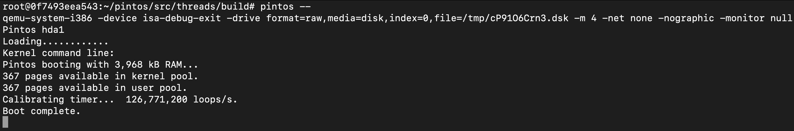
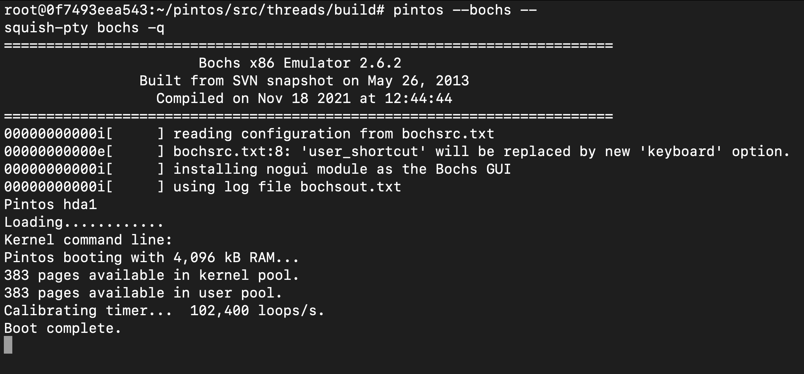
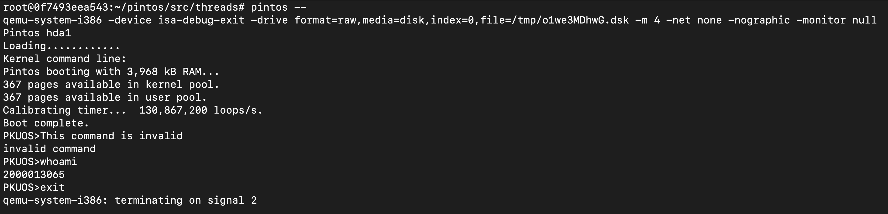

# Project 0: Getting Real

## Preliminaries

>Fill in your name and email address.

Hao Wang <tony.wanghao@stu.pku.edu.cn>

>If you have any preliminary comments on your submission, notes for the TAs, please give them here.

>Please cite any offline or online sources you consulted while preparing your submission, other than the Pintos documentation, course text, lecture notes, and course staff.

## Booting Pintos

>A1: Put the screenshot of Pintos running example here.

QEMU: 

Bochs:

## Debugging

#### QUESTIONS: BIOS 

>B1: What is the first instruction that gets executed?

sub %ax, %ax 

>B2: At which physical address is this instruction located?

0x7c00

#### QUESTIONS: BOOTLOADER

>B3: How does the bootloader read disk sectors? In particular, what BIOS interrupt is used?

It calls `read_mbr` and `next_sector`, which uses `read_sector` BIOS interrupt to read a new sector.

>B4: How does the bootloader decides whether it successfully finds the Pintos kernel?

It uses `cmpb $0x20, %es:4(%si)` to check if the current partition is a Pintos kernel partition.

>B5: What happens when the bootloader could not find the Pintos kernel?

It outputs "Not Found" and notify BIOS that boot failed.

>B6: At what point and how exactly does the bootloader transfer control to the Pintos kernel?

At address `7cd3`, after successfully finding and booting the Pintos kernel, the bootloader stores the start address of the Pintos kernel into a intermediate register `%dx`, which is then used in an indirect jump to the `pintos_init()` function in Pintos kernel.

#### QUESTIONS: KERNEL

>B7: At the entry of pintos_init(), what is the value of expression `init_page_dir[pd_no(ptov(0))]` in hexadecimal format?

0x0

>B8: When `palloc_get_page()` is called for the first time,

>> B8.1 what does the call stack look like?
>> 
>> #0  palloc_get_page (flags=(PAL_ASSERT | PAL_ZERO)) at ../../threads/palloc.c:112
>>
>> #1  0xc00203aa in paging_init () at ../../threads/init.c:168
>>
>> #2  0xc002031b in pintos_init () at ../../threads/init.c:100
>>
>> #3  0xc002013d in start () at ../../threads/start.S:180

>> B8.2 what is the return value in hexadecimal format?
>>
>> 0xc0101000

>> B8.3 what is the value of expression `init_page_dir[pd_no(ptov(0))]` in hexadecimal format?
>>
>> 0x0

>B9: When palloc_get_page() is called for the third time,

>> B9.1 what does the call stack look like?
>>
>> #0  palloc_get_page (flags=PAL_ZERO) at ../../threads/palloc.c:112
>>
>> #1  0xc0020a81 in thread_create (name=0xc002e895 "idle", priority=0, function=0xc0020eb0 <idle>, aux=0xc000efbc) at ../../threads/thread.c:178
>>
>> #2  0xc0020976 in thread_start () at ../../threads/thread.c:111
>>
>> #3  0xc0020334 in pintos_init () at ../../threads/init.c:119
>>
>> #4  0xc002013d in start () at ../../threads/start.S:180 

>> B9.2 what is the return value in hexadecimal format?
>>
>> 0xc0104000 

>> B9.3 what is the value of expression `init_page_dir[pd_no(ptov(0))]` in hexadecimal format?
>>
>> 0x103027

## Kernel Monitor

>C1: Put the screenshot of your kernel monitor running example here. (It should show how your kernel shell respond to `whoami`, `exit`, and `other input`.)

#### 

>C2: Explain how you read and write to the console for the kernel monitor.

I use `input_getc` from `devices/input.c` for input. For output, I use both `printf` from `lib/stdio.c` and `putchar`, `puts` from `lib/kernel/console.c`.
